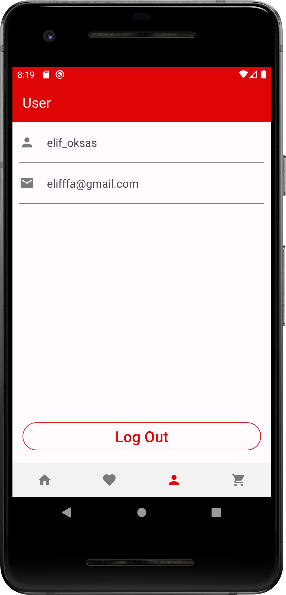

# Food Ordering App

This project contains the source code for a food ordering app developed as part of the Techcareer Android Developer Bootcamp. The app aims to provide users with a user-friendly mobile application to place food orders and manage them.

## Features

The main features of this project include:

- Users can log in to the app and manage their orders.
- They can browse the menu and place orders.
- Users can mark their favorite dishes.
- Tracking the status of orders.
- Searching for specific dishes in the menu.

## Technologies

We utilized the following key technologies and tools in the development of this project:

- Retrofit for handling API requests.
- Firebase for user authentication and managing favorites.
- Glide for smooth image loading from the server.
- Hilt for dependency injection.
- Navigation component for smooth app navigation.
- LiveData to observe and react to data changes.
- MVVM (Model-View-ViewModel) architecture for a clean and maintainable codebase.

## User Interfaces

  
  
  
  
  
  
  
  
 

Feel free to explore the source code and contribute to the project. If you have any questions or feedback, please don't hesitate to reach out. 

Happy coding! 🚀

